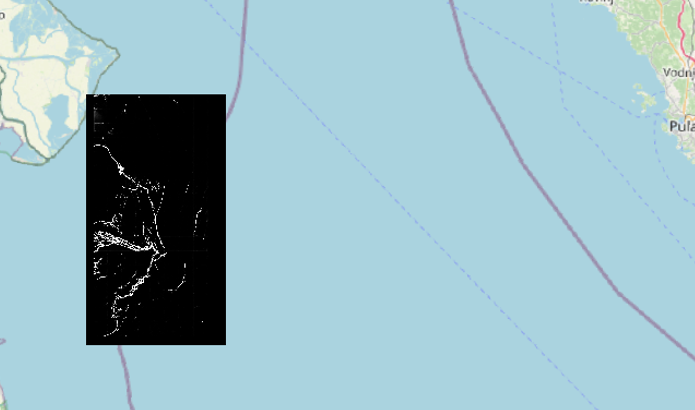

# DeltaTwin Mucilage Detection

DestinE DeltaTwin workflow creation/run/publish for mucilage detection using Sentinel-2 products.
For a detailed explanation on the DeltaTwin, see at: [DeltaTwin Doc](https://deltatwin.destine.eu/docs/introduction)

## Table of Contents

1. [Run the detector locally](#1---run-the-detector-locally)
   1. [Installation](#installation)
   2. [Running the Detector](#running-the-detector)
2. [Run the Detector via Delta Twin and Publish](#2---run-the-detector-via-delta-twin-and-publish)
   1. [Set up CDSE Credentials and Earth Data Hub Token](#set-up-credentials)
   2. [Test the Delta Twin Locally](#test-the-delta-twin-locally)
   3. [Publish the Delta Twin](#publish-the-delta-twin)
3. [Output Example](#output-example)
4. [Repository Structure](#repository-structure)

## 1 - Run the Processor Locally

### Installation

To run the od-detector locally, follow these steps:

1. **Clone the Repository**:

   ```bash
   git clone https://github.com/germanasergi/DeltaTwin-od-mucilage.git
   cd DeltaTwin-od-mucilage
   ```

2. **Create and Activate a Conda Environment**:

   ```bash
   conda create -n od-detector python==3.11.7
   conda activate od-detector
   ```

3. **Install the Required Dependencies**:

   ```bash
   pip install -r requirements.txt
   ```

### Running the Processor

To run the processor, execute the following command:

```bash
python models/main.py your_cdse_key your_cdse_secret your_edh_pat bbox start_date end_date
```

## 2 - Run the Detector via Delta Twin and Publish

### Set up CDSE Credentials

To set up your CDSE credentials and EDH personal token, edit the `inputs_file.json` JSON file by adding your CDSE key and secret:

```json
{
  "cdse_key": {
    "type": "string",
    "value": "your_cdse_key"
  },
  "cdse_secret": {
    "type": "string",
    "value": "your_cdse_secret"
  },
  "earth_data_hub_pat": {
    "type": "string",
    "value": "your_edh_pat"
  }
}
```

### Test the Delta Twin Locally

To test the Delta Twin locally, run the following command:

```bash
deltatwin run start_local -i inputs_file.json --debug
```

### Publish the Delta Twin

1. **Login to DeltaTwin**:
```
pip install deltatwin
```
2. **Log in**
```
deltatwin login username password -a https://api.deltatwin.destine.eu/
```
3. **Refresh token**
```
deltatwin login
```
4. **Run locally**
Goes to the Folder [Deltatwin](/DeltaTwin/), fill the [inputs_file](/DeltaTwin/inputs_file.json) and start by running locally
```
deltatwin run start_local -i inputs_file.json --debug 
```

5. **Publish the Component**
```
deltatwin component publish -t whatever-tag 0.0.1 
```

## 3 - Output Example

Below is an example of the Delta Twin output. The L2A product download, preprocessed, ingested by the model to generate the probability map and the binary mask of mucilage segmentation. The worflow should output a raster of mucilage location.




## 4 - Repository Structure

The repository is structured as follows:

```bash
├── README.md
├── inputs_file.json
├── manifest.json
├── models
│   ├── cfg
│   │   └── config.yaml
│   ├── .env
│   ├── .gitignore
│   ├── main.py
│   ├── model_zoo
│   │   └── models.py
│   ├── utils
│   │   ├── cdse_utils.py
│   │   ├── plot.py
│   │   ├── torch.py
│   │   └── utils.py
│   └── weights
│       └── unet_checkpoint.pth
├── workflow.yml
└── requirements.txt
```

This structure includes the main directories and files necessary for the DestinE DeltaTwin workflow creation for AI mucilage detection using Sentinel-2 products.